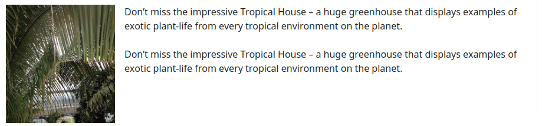

## Decorative Images

#### Images may be decorative when they are:
- Visual styling such as borders, spacers, and corners;
- Supplementary to link text to improve its appearance or increase the clickable area
- Identified and described by surrounding text.
- Illustrative of adjacent text but not contributing information (“eye-candy”)


#### Strategy
- add alt="" so that they can be ignored by assistive technologies, such as screen readers.
- Leaving out the alt attribute some screen readers will announce the file name of the image instead.
- Screen readers also allow the use of WAI-ARIA to hide elements by using role="presentation". However, currently, this feature is not as widely supported.
- Where possible, decorative images should be provided using CSS background images instead.

### Example 1: Image used as part of page design

```html

```

### Example 2: Decorative image as part of a text link

```html
<a href="https://www.youtube.com">
  
  <h6>Youtube</h6>
</a>
```

### Example 3: Image with adjacent text alternative

```html
<p>
  
  <div>The sleeping dogs:</div> ...
</p
```

### Example 4: Image with adjacent text alternative

```html

```
If the purpose of this image was to identify a plant or convey other information, rather than just to improve the look of the page, it should probably be treated as informative.

## Informative Images

### Example 1: Images used to label other information
 0123 456 7890
```html
 0123 456 7890
```

### Example 2: Images used to supplement other information
 0123 456 7890
```html

```

### Example 4: Images conveying an impression or emotion

```html

```
- This photograph shows a happy family group.  It’s being used to give the impression that the website or the company it represents is family-friendly.
- Note: If the purpose of this image were simply to improve the look of a page rather than convey an impression, it could be deemed to be decorative.

### Example 5: Images conveying file format

```html
<a href="#">2012 Annual report  (43KB)</a>
, also available in
<a href="#"> (254KB)</a>
or
<a href="#"> (353KB)</a>
format.
```