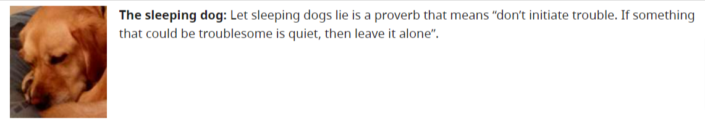
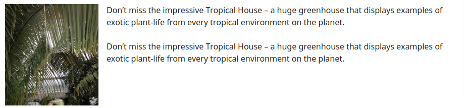
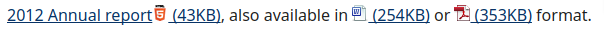

## [1] Hình ảnh trang trí

```html
- Thêm alt="" để ảnh có thể bị bỏ qua bởi các công nghệ hỗ trợ, chẳng hạn như trình đọc màn hình.
- Tùy chọn khác là nên cung cấp hình ảnh trang trí bằng cách sử dụng hình ảnh nền CSS.
- Trình đọc màn hình cũng cho phép sử dụng WAI-ARIA để ẩn các phần tử bằng cách sử dụng role="Presentation".
Tuy nhiên hiện tại tính năng này không được hỗ trợ rộng rãi.
```

#### 01. Hình ảnh là 1 phần của thiết kế trang


```html

```

```html
- Thiết kế trang có thể là đường viền, bo góc, ảnh button,...
```

#### 02. Hình ảnh trang trí là một phần của liên kết văn bản


```html
<a href="https://www.youtube.com">
  
  <h6>Youtube</h6>
</a>
```

```html
- Hình ảnh bổ sung cho văn bản liên kết để cải thiện sự xuất hiện, đồng thời tăng diện tích có thể click
```

#### 03. Hình ảnh được mô tả đầy đủ bằng văn bản liền kề


```html
<p>
  
  <div>The sleeping dogs:</div> ...
</p
```

```html
- Hình ảnh con chó đang ngủ này đã được mô tả đầy đủ bằng văn bản liền kề vì vậy không cần thiết phải lặp lại thông tin.
```

#### 04. Minh họa cho văn bản liền kề nhưng không đóng góp thông tin (eye-candy)


```html

```

```html
- Mục đích của hình ảnh để cải thiện giao diện của trang, chứ không truyền tải hay cung cấp thông tin.
- Chỉ tác giả mới xác định được chính xác mục đích cho việc sử dụng hình ảnh.
```

## [2] Hình ảnh cung cấp thông tin

#### 01. Hình ảnh minh họa, bổ xung thông tin, truyền đạt ấn tượng hoặc cảm xúc


```html

```

```html
- Bức ảnh này cho thấy một nhóm gia đình hạnh phúc. Nó được sử dụng để tạo ấn tượng rằng trang web hoặc công ty mà nó đại diện là thân thiện với gia đình.
- Lưu ý: Nếu mục đích của hình ảnh này chỉ đơn giản là để cải thiện giao diện của trang thì nó có thể được coi là hình ảnh trang trí.
```

#### 02. Hình ảnh được sử dụng để gắn nhãn thông tin khác
 0123 456 7890

```html
 0123 466 7890
```

#### 03. Hình ảnh chuyển tải định dạng tệp


```html
<a href="#">2012 Annual report  (43KB)</a>, 
also available in <a href="#"> (254KB)</a>
or <a href="#"> (353KB)</a> format.
```

```html
- Hình ảnh biểu thị chức năng in có văn bản thay thế “In trang này” 
vì mục đích của nó là để kích hoạt chức năng in khi nó được chọn.
```

## [3] Hình ảnh mang chức năng
<a href="javascript:print()">
  
</a>

```html
<a href="javascript:print()">
  
</a>
```

## [4] Nhiều hình ảnh truyền tải một phần thông tin


```html


```

```html
- 5 ảnh ngôi sao cùng đại diện cho xếp hạng. 
Chỉ một trong các hình ảnh cần thay thế văn bản, các hình ảnh khác có thuộc tính alt="" để chúng bị công nghệ hỗ trợ bỏ qua.
```