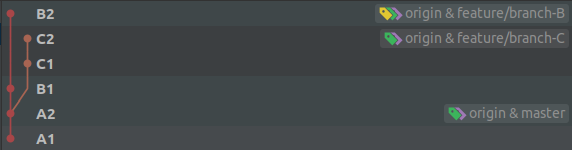
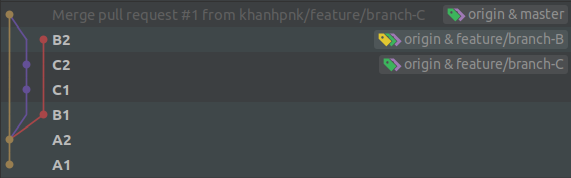
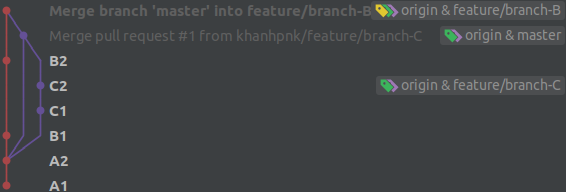
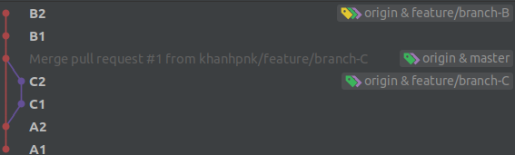
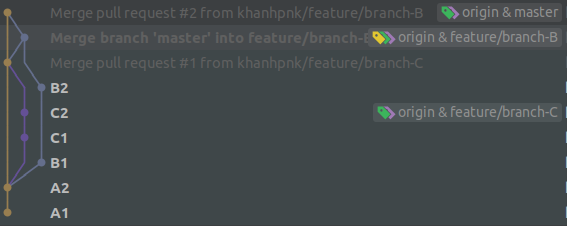
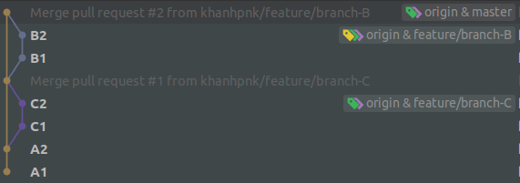

- Berore merge pull request

- After merge pull request branch-C -> master

Now C1, C2 In branches: master, feature/branch-C

| Merge | Rebase |
| ------------ | ------------- |
| After merge master -> branch-B | After rebase master -> branch-B |
|   |  |
| After merge pull request branch-B -> master  | |
|   |  |